# 섹션 01. 초기화 과정 이해
## 01. 프로젝트 생성 / 의존성 추가
### 자동 설정에 의한 기본 보안 작동
서버가 가동되면 `스프링 시큐리티 초기화 및 보안 설정`이 `자동`적으로 이루어진다.
- 별도의 `설정`, `코드`를 작성하지 않아도 `기본적 웹 보안 기능`이 현재 시스템에 연동되어 작동함
  1) 기본적으로 `모든 요청`에 대해 `인증여부 검증`, `인증 승인`이 되어야 `자원 접근 가능`
  2) 인증 방식의 경우 `폼 로그인`, `httpBasic 로그인` 방식을 제공
  3) 인증 시도가 가능한 `로그인 페이지`가 자동적으로 생성되 렌더링 됨
  4) 인증 승인이 이루어질 수 있도록 `한 개`의 계정이 기본적으로 제공
    - `SecurityProperties` 설정 클래스에서 생성
    - `username : user`, `password : 랜덤 문자열`
- `SpringBootWebSecurityConfiguration`에서 자동 설정에 의해 `기본 보안 설정 클래스 생성`을 해줌  
  

### 의존성 주입 후 애플리케이션 실행
#### 01. 애플리케이션 실행
우선 애플리케이션을 실행하면 콘솔에서 아래의 내용을 확인 할 수 있다.  
 
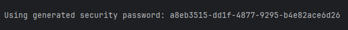
- 위에서 설명한 인증이 이루어질 수 있게 제공되는 `계정의 패스워드`이다.
  - `아이디(username)`은 `"user"`로 자동 생성된다.
- 초기화 기준이기 때문에 `애플리케이션을 새로 생성`하면 패스워드는 `바뀐다`.  
 

#### 02. 폼 로그인
이번에 제공되는 인증 방식 중 `폼 로그인`을 통해 인증을 시도해보자  
 
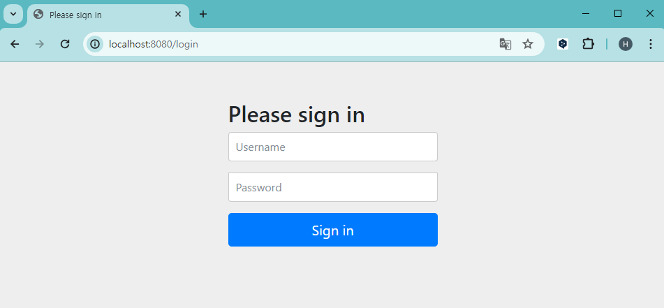
- 주소창에 `localhost:8080`을 입력하면 `스프링 시큐리티가` 제공해주는 `로그인 화면`을 볼 수 있다.
- `username`에는 `"user"`를 입력, `password`에는 아까 콘솔에서 확인한 `랜덤 생성`된 패스워드를 입력해준다.
- 로그인에 성공하면 임시로 만들어둔 컨트롤러를 통해 결과가 반환된다.
  - 실패시에는 `"자격 증명에 실패했습니다"`라는 오류 메시지가 출력된다.  
   

## 02. SecurityBuilder / SecurityConfigurer
스프링 시큐리티에서 `가장 핵심적인 두 클래스`이다.
- `SecurityBuilder`: 빌더 클래스로 웹 보안을 구성하는 `Bean 객체`와 `설정 클래스`들을 `생성`하는 역할을 함
  - 대표적으로 `WebSecurity`와 `HttpSecurity`가 있으며, 이 중 `HttpSecurity`는 비중이 높은 클래스이다.  
 

- `SecurityConfigurer`: `Http 요청`과 관련된 `보안처리`를 담당하는 `필터`들을 `생성`, 여러 `초기화 설정`에 관여함
  - 스프링 시큐리티에서 `모든 인증`과 `인가요청`을 처리할 때 `필터`를 통해 처리한다.
  - 스프링 시큐리티는 다르게 표현하면 `필터 기반 보안 프레임웍`이라 할 수 있다.  
 

### 정리
`SecurityBuilder`는 `SecurityConfigurer`를 `참조(사용)`하며 `인증 및 인가 초기화` 작업은 `SecurityConfigurer`를 통해 진행된다.  
 
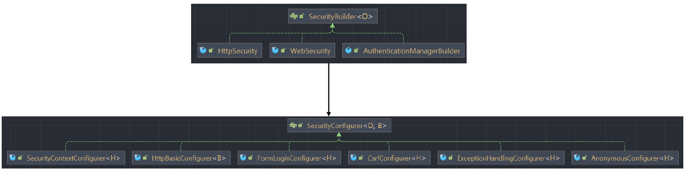
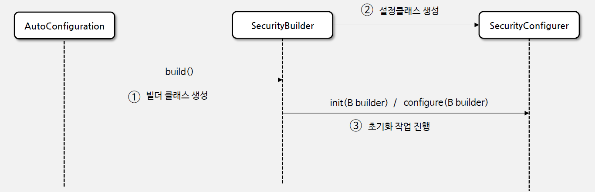
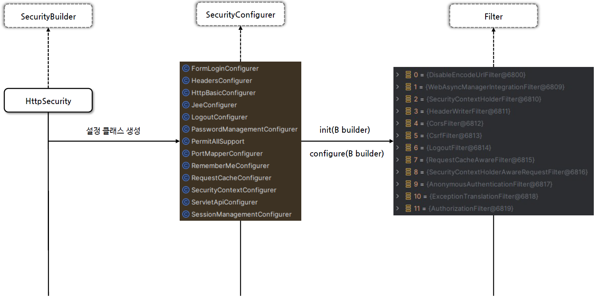
- 결국 `SecurityBuilder` 클래스가 `설정 클래스`들을 생성한 다음 `설정 클래스가 가진 여러 기능`들을 진행시켜 초기화 작업을 이끌어 나감  
   

## 03. HttpSecurity / WebSecurity
### HttpSecurity
설정 클래스인 `HttpSecurityconfiguration`에서 `HttpSecurity`를 `생성`하고 `초기화 진행`함  
 
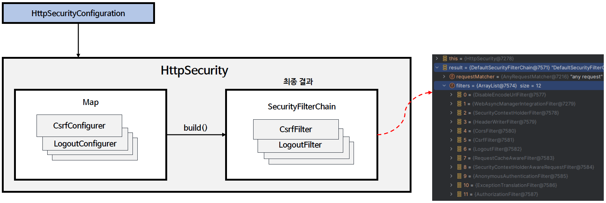
- `HttpSecurity`는 `보안`에 필요한 각 `설정 클래스와 필터`들을 `생성`, 최종적으로 `SecurityFilterChain` Bean 생성
- 전반적으로 모든 `인증과 인과 관련 설정`이 가능하기에 굉장히 중요한 클래스라 할 수 있음  
  

### SecurityFilterChain
여러 개의 `필터들의 목록`을 관리하는 `인터페이스`  
 
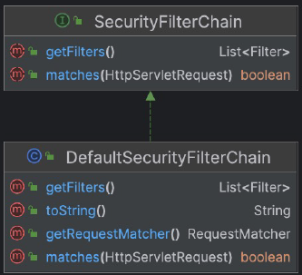
- 구현체는 `DefaultSecurityFilterChain`이다.  
 

- `boolean matches(HttpServletRequest Request)`
  - 요청이 현재 `SecurityFilterChain`에 의해 처리되어야 하는지 여부 결정
    - 여러개의 필터 체인이 `HttpSecurity`에 의해 생성 될 수 있음
    - 어떤 필터 체인이 현재 요청에 가장 적합한지는 따지는 작업이라 할 수 있음
  - `true` 반환 시, `현재 필터 체인에 의해 처리 되어야 한다`를 의미
  - `false` 반환 시, `다른 필터 체인 또는 처리 로직에 의해 처리되어야 한다`를 의미  
 

- `List<Filter> getFilters()`
  - 현재 `SecurityFilterChain`에 포함된 `Filter 객체`의 리스틑 반환
  - 어떤 필터들이 현재 필터 체인에 포함되어 있는지 확인 가능
    - 각 필터는 요청 처리 과정에서 `특정 작업(인증, 권환 부여 등)`을 수행  
 

#### SecurityFilterChain 작업 과정
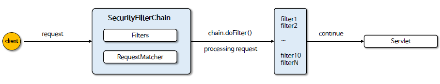  
  

### WebSecurity
`WebSecurityConfiguration`에서 `WebSecurity`를 `생성`하고 `초기화 진행` 함  
 
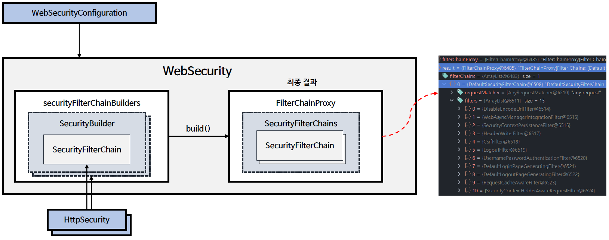
- `WebSecurity`는 `HttpSecurity`에서 생성한 `SecurityFilterChain` Bean 을 `SecurityBuilder`에 저장
- `WebSecurity`가 `build()`를 실행하며 `SecurityBuilder`에서 `SecurityFilterChain`을 꺼내 `FilterChainProxy` 생성자에 전달
- 결과적으로 `FilterChainProxy`에 `SecurityFilterChain`을 저장하게 되었다.
  - 사실 상 `HttpSecurity`에서 `SecurityFilterChain` Bean 을 생성한 것은 `FilterChainProxy`에 저장하기 위해서라 할 수 있다.
  - 이렇게 보면 `WebSecurity`가 `HttpSecurity`의 상위 개념이라 볼 수 있다.  
   

## 04. DelegatingFilterProxy / FilterChainProxy
### Filter
`서블릿 필터`는 웹 애플리케이션에서 `클라이언트의 요청(HttpServletRequest)`과 `서버의 응답(HttpServletResponse)`을 `가공`하거나 `검사`하는데 사용되는 구성 요소
- 클라이언트의 요청이 `서블릿에 도달하기 전`이나 서블릿이 응답을 `클라이언트에게 보내기 전`에 `특정 작업`을 수행 할 수 있음
- `서블릿 컨테이너(WAS)`에서 `생성`되고 `실행`되며 `종료`된다.  
 

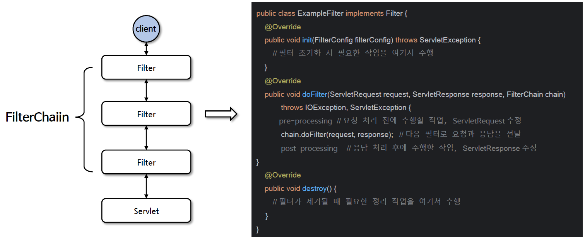
- 물론 필터는 `옵션`이다. 생성을 해도되고 안 해도 상관없다.
  - 생성한다면 `클라이언트 요청`이 필터를 거쳐 서블릿에 도달 할 것이며, 생성하지 않는다면 바로 서블릿에 도달 할 것이다.
- 위 그림에서 `doFilter()`를 보면 `chain.doFilter(request, response);`에 `주목`하도록 하자
  - 해당 코드 전과 후로 나누어보면 `전`에는 요청 처리전에 `클라이언트의 요청`을 가공 할 수 있을 것이다.
  - `후`에는 응답 처리 후에 `서버 응답`을 가공 할 수 있을 것이다.  
  

### DelegatingFilterProxy
필터를 `구현`한 필터 클래스이다.  
 
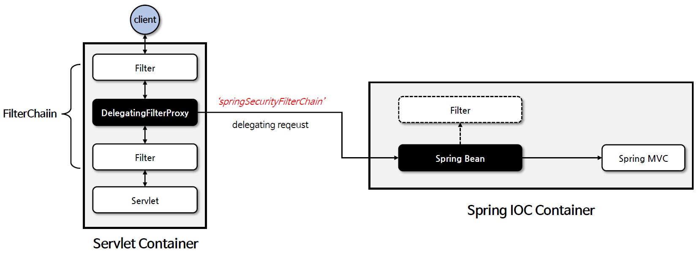
- 스프링에서 사용되는 `특별한 서블릿 필터`로, `서블릿 컨테이너 - 스프링 애플리케이션 컨텍스트`의 `연결고리 역할`을 하는 필터
- 서블핏 필터의 기능을 수행하는 동시에 `스프링의 읜존성 주입` 및 `Bean 관리 기능`과 `연동`되도록 설계된 필터
- `"springSecurityFilterChain"`이란 이름으로 생성된 Bean 을 `ApplicationContext`에서 찾아 요청을 `위임`한다.
  - 결국 해당 클래스를 거치지 않고서는 스프링 시큐리티로 갈 수 없음
    - 해당 클래스가 `FilterChainProxy`를 찾기 때문이다.
- 단, `실제 보안 처리`를 수행하지 않음  
  

### FilterChainProxy
`"springSecurityFilterChain"`이란 이름으로 생성되는 필터 Bean 으로서 `DelegatingFilterProxy`로 부터 요청을 `위임`받고 `보안 처리 역할`을 함  
 
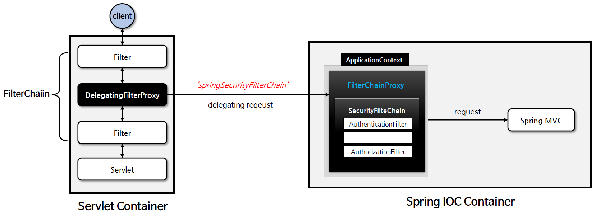
- 내부적으로 하나 이상의 `SecurityFilterChain` 객체(들을)를 가지고 있음.
- `요청 URL` 정보 기준으로 적절한 `SecurityFilterChain`을 `선택`해 필터들을 `호출`하는 역할
- `HttpSecurity`를 통해 `API 추가 시` 관련 필터들이 추가 됨
- 사용자 요청을 `필터 순서`대로 호출하기에 보안 기능 동작 후 필요하다면 `직접 생성한 필터`를 기존 필터 전과 후에 `추가 가능`
  - 마지막 순서의 필터까지 `특별한 예외`나 `오류`가 발생하지 않으면 요청이 `서블릿`으로 넘어가게 됨  
   

## 05. 사용자 정의 보안 설정하기
### 사용자 정의 보안 기능 구현
한 개 이상의 `SecurityFilterChain` 타입의 Bean 을 정의한 후 `인증 API` 및 `인가 API`를 설정한다.  
 
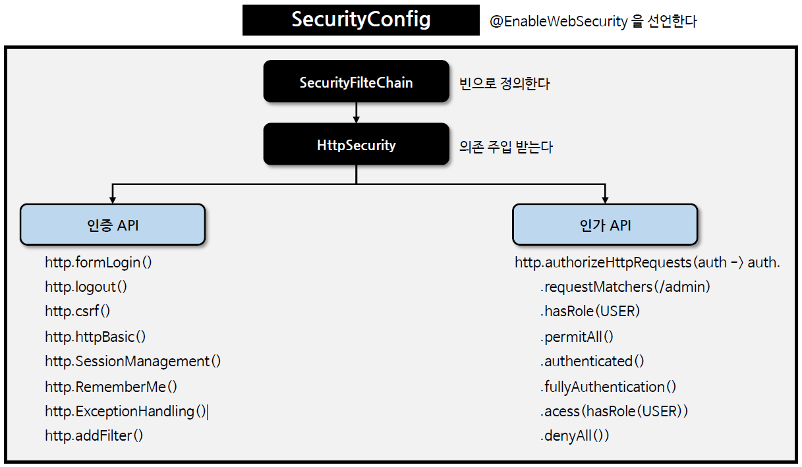